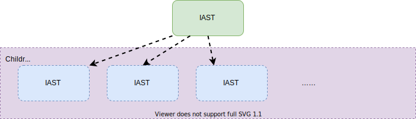
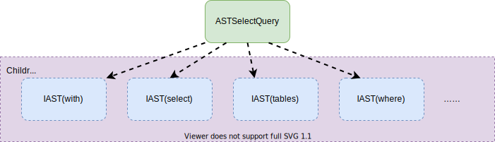

# SQL  to AST


一般来说，ClickHouse 服务端会监听不同的端口，以支持不同的协议，
一般情况下是（TCP：9000， MySQL：3306， HTTP：8123）等。
客户端通过一种协议连接上之后，发送SQL给服务端，服务端根据协议从网络包里拿到SQL，
这些属于网络开发，故不赘述。
拿到SQL之后，才真正算是进入了数据库服务端的地盘。
那么拿到SQL之后，数据库会怎么处理呢？当然是解析SQL，并把它保存在一种程序方便处理的数据结构，
抽象语法树 AST(Abastract Syntax Tree).下文我们会讲讲Clickhouse的解析器。
## AST
   插播一手AST。
   抽象语法树？是啥？
   首先它是一个树。为什么得是一个树呢？
    因为有的SQL查询会嵌套好多层，树就很适合这种递归的结构。
    还有就是它的用途是用来表达抽象的语法的，故叫抽象语法树。
    说到这，还是抽象语法树还是满抽象的。或许举个例子，就会好很多。ClickHouse是一个OLAP数据库，
    最常用到的SQL应该就是Select了，下边我们将会举一个Select 是如何转换成抽象语法树的例子。

#### IAST
IAST是抽象语法树的BaseClass，其它的类都继承它。
IAST的结构非常简单，它只有一个children成员，本质就是一个`vector<IAST>`.
```cpp
// ASTs
class IAST;
using ASTPtr = std::shared_ptr<IAST>;
using ASTs = std::vector<ASTPtr>;


// IAST
class IAST : public std::enable_shared_from_this<IAST>, public TypePromotion<IAST>
{
public:
    ASTs children;
//...
}
```
这样的数据结构和树怎么联系上呢？



画成这样是不是有树的感觉了呢？

### ASTSelectQuery

这里开始讲一下SelectQuery的抽象语法树，
在ClickHouse中，Select语句中常见的keyword如下：
```cpp
enum class Expression : uint8_t
    {
        WITH,
        SELECT,
        TABLES,
        PREWHERE,
        WHERE,
        GROUP_BY,
        HAVING,
        WINDOW,
        ORDER_BY,
        LIMIT_BY_OFFSET,
        LIMIT_BY_LENGTH,
        LIMIT_BY,
        LIMIT_OFFSET,
        LIMIT_LENGTH,
        SETTINGS
    };
```
于是SelectQuery就分别每个keyword解析为一种AST，
然后放在Children对象里，大致的结构图如下



此时我们对抽象语法树，大概有了一个认识。下边开始讲解析。
## Parser解析


比起大部分的解析器，用了YACC等辅助工具，ClickHouse的解析器就显得十分的朴素了，
是手工打造的。
对于刚开始学数据库的小白来说，算是比较友好的一种类型，因为看得懂 ：）
下边会介绍一些基本的概念，以及列举一些代码解释ClickHouse是如何解析SQL的。

### Tokens
token在网上搜索它的意思是：
> Token在计算机身份认证中是令牌（临时）的意思，在词法分析中是标记的意思。

在我们这里的上下文，它就是标记的意思。那么标记又是什么意思呢？
说的通俗点，可以粗略想象为一个python的split函数
```python
>>> query = 'SELECT col_1, col2 FROM `db`.`t`'
>>> tokens = query.split()
>>> print(tokens)
['SELECT', 'col_1,', 'col2', 'FROM', '`db`.`t`']
```
大概是这个意思，当然并不准确，就是把一个句子拆成多个词语的意思。
后续解析的时候就可以按照word的单位进行，而不是按照char的单位进行。

### 解析过程
ClickHouse解析的大体思路如下：
```cpp
AST res；
bool isParseSuccess = parser1.parse(res) || parser2.parse(res) || parser3.parse(res);
```
对于每一种AST都有一个它自己的parser，
ClickHouse对传进来的SQL会尝试使用每一种parser解析，
直到某一个成功，或者全部失败（或操作的短路逻辑）。
如果解析成功的就会把解析结果存在我们传入的空白AST(res)里。

下边将会结合代码分析上文的SQL的解析过程：
```sql
SELECT col_1, col_2 FROM `db`.`t`
```
找到`ParserSelectQuery.cpp`
只截取与我们这个SQL解析紧密相关的代码
```cpp
    //...
    //这里是解析SELECT关键字，并忽略它，
    //如果没有SELECT关键字就表示不是一个SelectQuery，直接返回false
    if (!s_select.ignore(pos, expected))
        return false;
    //...
    //解析`col_1, col_2`
    //若成功就会把解析结果写入`select_expression_list`这个变量，并返回true
    //若失败就返回false
    if (!exp_list_for_select_clause.parse(pos, select_expression_list, expected))
        return false;
    //...
    // 这里是解析FROM关键字并忽略它
    // FROM database.table or FROM table or FROM (subquery) or FROM tableFunction(...)
    if (s_from.ignore(pos, expected))
    {
        //解析`db`.`t` 并存入tables
        if (!ParserTablesInSelectQuery().parse(pos, tables, expected))
            return false;
    }
    //将中间结果都保存到最初始传入的AST中
    select_query->setExpression(ASTSelectQuery::Expression::SELECT, std::move(select_expression_list));
    select_query->setExpression(ASTSelectQuery::Expression::TABLES, std::move(tables));
```
至此解析完毕并把结果存入了一个ASTSelectQuery中。
后续将会是对这个AST做一些优化，比如谓词下推，const fold等。