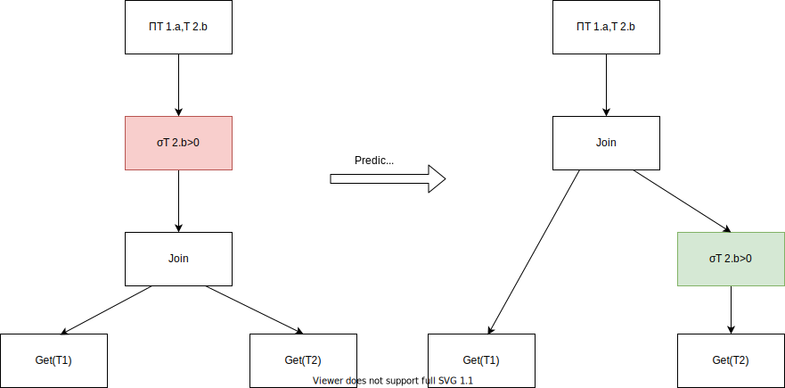

# AST Rewrite

上一节介绍了如何从一个SQL-〉AST，
这一节将会介绍AST-〉AST

Parser解析得到AST，InterpreterFactory会得到指定类型的
Interpreter比如我们的SelectQuery就会是SelectQueryInterpreter。
AST Rewrite就是在SelectQueryInterpreter的构造函数中。
`src/Interpreters/InterpreterSelectQuery.cpp`
在它的构造函数中我们可以发现主要做了两个部分的工作：

1. Rewrite Joins
2. analyze

### Rewrite Join
这里做的还是比较琐碎的事情，大概就是把CrossJoin改为InnerJoin，
还有就是把多个join on条件改写为多个subquery。
此处没有考虑join顺序这些，这些还依赖于Cost-Based Optimizer，但是
ClickHouse并没有CBO。不赘述。


### analyze
这里就是Rewrite的主要部分了，会把ast重写成一个新的AST, 
以及会把一部分整理后的信息放到TreeRewriteResult中去。
```cpp
    auto analyze = [&] (bool try_move_to_prewhere)
    {
        //...
        syntax_analyzer_result = TreeRewriter(context).analyzeSelect(
            query_ptr,
            TreeRewriterResult(source_header.getNamesAndTypesList(), storage, metadata_snapshot),
            options, joined_tables.tablesWithColumns(), required_result_column_names, table_join);
        //...
        if (try_move_to_prewhere && storage && query.where() && !query.prewhere())
        {
            //...
        }

        if (query.prewhere() && query.where())
        {
            //...
        }
        //...
    }
```

主要是在 `TreeRewrite.analyzeSelect` 中做了大部分的重写,其它地方做了少量的重写。

还是举一个pushdown的例子


对于这样的一条查询:
```sql
SELECT T1.a, T2.b
FROM T1, T2
where T2.b > 0
```
一般来说，这个SQL解析之后得到的AST就是下图左边的样子，
会先把`T1`, `T2` Join在一起，然后才使用`WHERE T2.b > 0`进行过滤。
那么这里问题就出现了。
假设`T1`有`m`个records，而`T2`有`2n`个records，其中只有2条满足`T2.b > 0`

如果没有做谓词下推操作，那么CrossJoin则会计算`m * 2n`条的结果，然后再做过滤处理。

另一方面，我们在看谓词下推如下图的右边所示，我们把过滤在Join之前给做了。
继续按前文所提到的数据量来看，此时这个filter之后，就只有`2`条records，Join就只需要处理 `m * 2`的结果，
计算量提高了N倍，这里我们可以感受到AST Rewrite的巨大作用。
  

