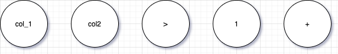
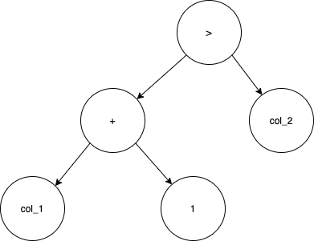
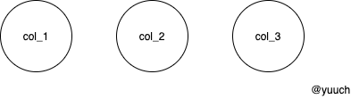
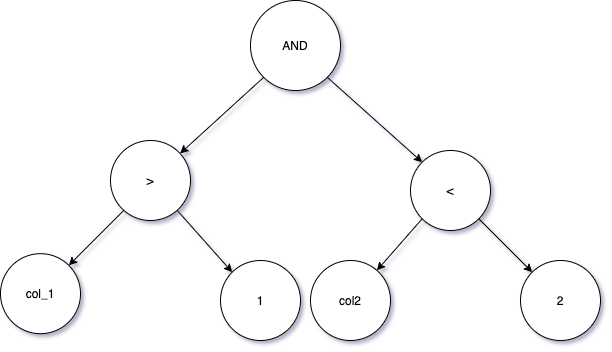
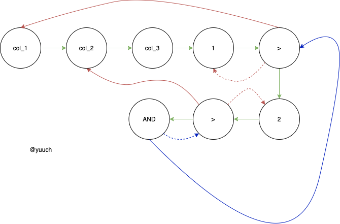
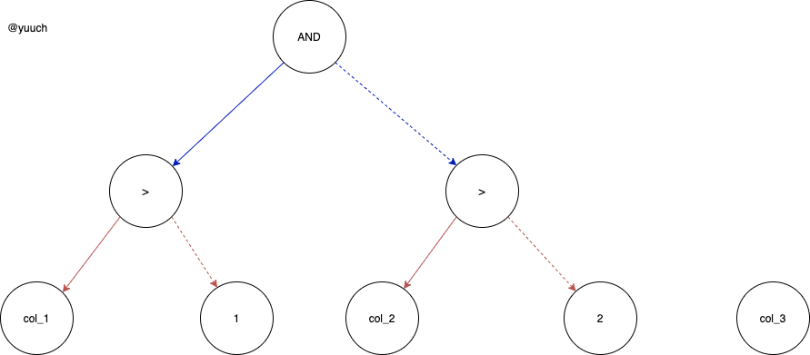
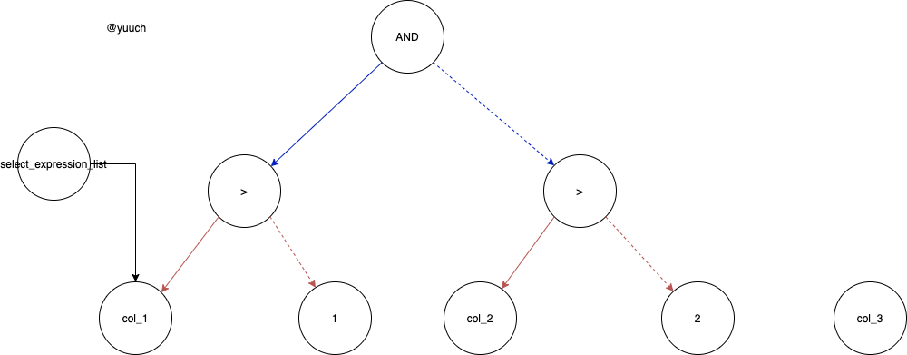

# 从TreeRewriterResult 到 ActionsDAG

## 先介绍一下什么是ActionDAG

ActionDAG顾名思义，就是由Action组成的DAG(有向无环图),下边我们会解释如何表示Action以及如何构成一个DAG。在ActionDAG中每一个节点都是一个Action.
Nodes包括5个类型：
```cpp
    enum class ActionType
    {
        /// Column which must be in input.
        INPUT,
        /// Constant column with known value.
        COLUMN,
        /// Another one name for column.
        ALIAS,
        /// Function arrayJoin. Specially separated because it changes the number of rows.
        ARRAY_JOIN,
        FUNCTION,
    };

```



如图所示，图中显示了5个节点，其中ActionType是这样子的：


|ActionName| ActionType|
|----------|-----------|
|col_1     |  INPUT     |
|col_2     |  INPUT     |
|1     |COLUMN     |
| >    | FUNCTION|
| +    | FUNCTION|


但是就这样的五个节点就很单薄，就没法表达出什么信息。因为太过于零散了，我们甚至可以臆想
出很多种结果：`col_2 + col_1 > 1`, `col_1 + 1 > col_2`, `col_2 > col_1 + 1`...
如何做到表达的信息是准确的呢？那就要想到这是一个DAG,可以在节点之间加上边的关系，构成一个图。

在严格确定子节点的顺序的情况(对于我们例子中的二元运算符`>`来说就是左右子树是有区别的),我们要表达一个`col_1 + 1 > col_2` 可以使用如下图：



## 回到ASTExpression如何生成ActionDAG

TreeRewriterResult 可以构建 SelectQueryAnalyzer 
通过SelectQueryAnalyer可以把多个expreesion转换成DAGActions
并把这些保存在AnalysisResult中
具体生成是在ExpressionAnalysisResult中调用query_analyzer的成员函数来生成，大概的调用代码如下：
```cpp
...
        query_analyzer = std::make_unique<SelectQueryExpressionAnalyzer>(
            query_ptr,
            syntax_analyzer_result, // TreeRewriterResult
            context,
            metadata_snapshot,
            NameSet(required_result_column_names.begin(), required_result_column_names.end()),
            !options.only_analyze,
            options,
            std::move(subquery_for_sets),
            std::move(prepared_sets));
...
Block InterpreterSelectQuery::getSampleBlockImpl()
{
...
    analysis_result = ExpressionAnalysisResult(
        *query_analyzer, metadata_snapshot, first_stage, second_stage, options.only_analyze, filter_info, source_header);
...
}
```

ExpressionAnalysisResult 构造的过程。
根据逻辑计划，通过queryAnalyzer生成多个DAG，并把结果存在Analysis中。

给定一个这样的表：
```sql
CREATE TABLE t
(
    `col_1` Int32,
    `col_2` Int32,
    `col_3` Int32,
)
ENGINE = MergeTree()
ORDER BY col_1
```

一个这样的sql是怎么执行的呢? 是怎么从AST->ActionsDAG的呢？
```sql
SELECT col_1
FROM t
WHERE col_1 > 1 and col_2 < 2
```
大致过程是这样的：
appendJoin
->
appendwhere 
->
appendSelect

### appendJoin

由于我们这里只有一张表，没有join操作，所以第一步之后，系统会让我和一个faktableJoin，于是得到了自己的所有列，
表现在ActionsDAG上就是多个没有关系的节点：



可以看作是ActionsDAG的初始化。

### appendWhere

比如 where的sql，TreeRewriter没对它做什么改动的话，那么它的AST就还是下边的样子。

```sql
WHERE col_1 > 1 AND col_2 > 2
```

它AST(Abstract Syntax Tree)是这样一个图



QueryAnalyzer会对AST进行遍历，然后生成一个与之相似的DAGActions



这里绿色箭头的表示的ActionsDAG的底层实现，它用的是`std::list`。
当我们遍历AST到节点`1`，的时候我们发现上一步的结果里不存在这个节点，我们就要在list的结尾加上它。再接下来会遍历到`col_1`与`1`的父节点`>`,同样发现它不存在也要加上它，这时候这个子树就遍历结束了。对于`>`,因为这是一个二元运算，只需要区别左子树与右子树就OK，我们用实线表示左子树，用虚线表示右子树。然后继续遍历，最终我们就得到了上图，这样看有点乱，我们隐藏底层的实现重新整理一下



这时候会发现这个`where`的DAG与原来AST的结构一模一样 :)

## apendSelect

```sql
select_expression_list
```

接下来我们会继续忽略底层数据结构实现：



最后得到的上图就是最后大致的ActionsDAG了，后续会把这个DAG用于QueryPlan的构建
