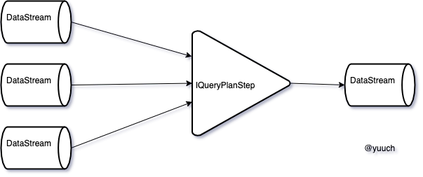
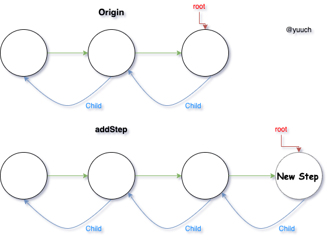
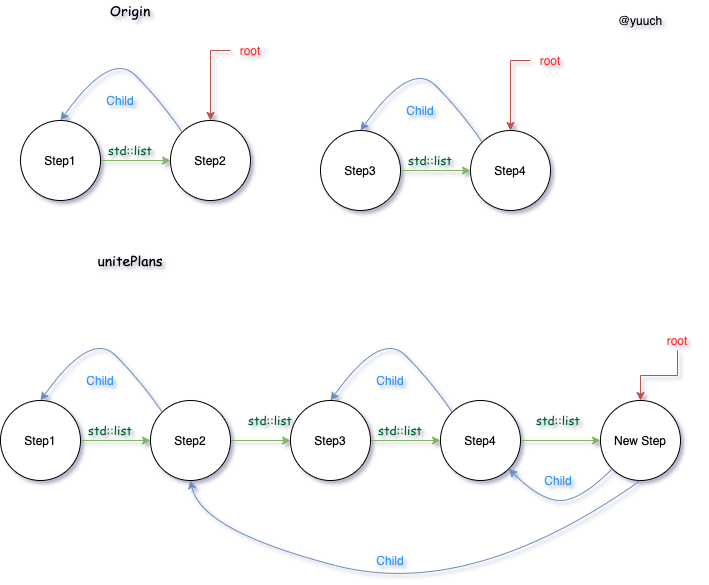
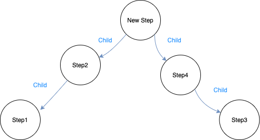

# DAGActions to QueryPlan

## 首先介绍一下什么是Step

Step是QueryPlan中的一个单独的一步，它代码中大概是这样的：
```CPP
/// Single step of query plan.
class IQueryPlanStep
{
    const DataStream & getOutputStream() const;
///ignore other details
protected:
    DataStreams input_streams;
    std::optional<DataStream> output_stream;
};

```



一般来说(除了开头与结尾的Step)每一个Step接收一个或多个DataStream，然后操作之后，DataStream传给下一步。

**ActionsDAG又与DataStream或者这里的Step有什么关系呢？**

```cpp
Step::Step(ActionsDAG, DataStreams){};
```


## 然后Step如何组成QueryPlan
根据QueryPlan里的定义，QueryPlan可以理解为是一棵树。
```cpp

/// A tree of query steps.
/// The goal of QueryPlan is to build QueryPipeline.
/// QueryPlan let delay pipeline creation which is helpful for pipeline-level optimizations.
class QueryPlan
{
public:

    void unitePlans(QueryPlanStepPtr step, std::vector<QueryPlanPtr> plans);
    void addStep(QueryPlanStepPtr step);

    const DataStream & getCurrentDataStream() const; /// Checks that (isInitialized() && !isCompleted())
    /// ignore other things

    QueryPipelinePtr buildQueryPipeline(
        const QueryPlanOptimizationSettings & optimization_settings,
        const BuildQueryPipelineSettings & build_pipeline_settings);

    /// Tree node. Step and it's children.
    struct Node
    {
        QueryPlanStepPtr step;
        std::vector<Node *> children = {};
    };

    using Nodes = std::list<Node>;

private:
    Nodes nodes;
    Node * root = nullptr;
};
```

QueryPlan主要是通过addStep与unitePlans这两个函数一步一步的把树给建起来。



addStep就是在结尾加一个Node，并把root指向结尾。如果单纯通过addStep的话，那么得到的树，就是一个与std::list实现相反的一棵一字型的树 XD

仅仅是一字型的树的话，是不是表达能力就太弱了呢？还能满足表示执行计划的需求吗？于是unitePlans就出来救场了。
给出两个Plan，在unitePlans的作用下，把每一个plan的结点都加入到nodes中，并保持其中的父子关系。加入一个NewStep，并把NewStep的Child指向之前出现的Plan的root结点，并把最终的root指向NewStep



忽略掉真实的数据结构的实现(std::list),我们终于画出了一颗我们传统印象里的树了。




QueryPlan这一步开始感觉有一点物理执行计划的味道了。在clickhouse这个逻辑和物理计划的区分真是不太明显呢
Query执行的通常顺序是？

where

limit

and so on ..

最后一步一步构成了一个完整树，完整的树就是一个QueryPlan,DataStream的流动方向与Child的指向方向相反。


