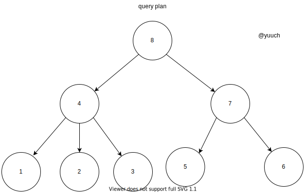

# QueryPlan to QueryPipeline

首先，还是得说明一下什么是query pipeline?
```cpp

```
QueryPlan用来生成QueryPipeline的主要步骤就是在下边这个函数里：

```cpp
QueryPipelinePtr QueryPlan::buildQueryPipeline(
    const QueryPlanOptimizationSettings & optimization_settings,
    const BuildQueryPipelineSettings & build_pipeline_settings)
{
    checkInitialized();
    optimize(optimization_settings);

    struct Frame
    {
        Node * node = {};
        QueryPipelines pipelines = {};
    };

    QueryPipelinePtr last_pipeline;

    std::stack<Frame> stack;
    stack.push(Frame{.node = root});

    while (!stack.empty())
    {
        auto & frame = stack.top();

        if (last_pipeline)
        {
            frame.pipelines.emplace_back(std::move(last_pipeline));
            last_pipeline = nullptr; //-V1048
        }

        size_t next_child = frame.pipelines.size();
        if (next_child == frame.node->children.size())
        {
            bool limit_max_threads = frame.pipelines.empty();
            last_pipeline = frame.node->step->updatePipeline(std::move(frame.pipelines), build_pipeline_settings);

            if (limit_max_threads && max_threads)
                last_pipeline->limitMaxThreads(max_threads);

            stack.pop();
        }
        else
            stack.push(Frame{.node = frame.node->children[next_child]});
    }

    for (auto & context : interpreter_context)
        last_pipeline->addInterpreterContext(std::move(context));

    return last_pipeline;
}
```


上面那个函数第一眼看很绕，多看几眼之后就会发现它是一个类似于树的后序遍历(LRN)的算法。
因为执行计划不是二叉树，所以只能说是类似于LRN。



那么它的执行将会是按照

`1` -> `2` -> `3` -> `4` -> `5` -> `6` -> `7` -> `8`

的顺序遍历执行计划，并生成一个pipeline。

proccessors?
where are these init?

