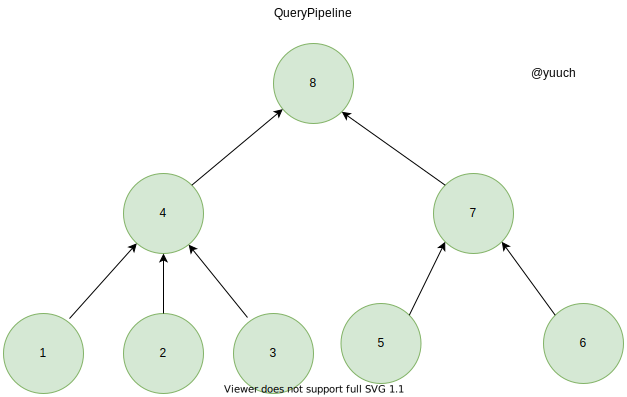
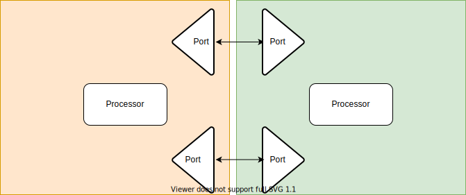
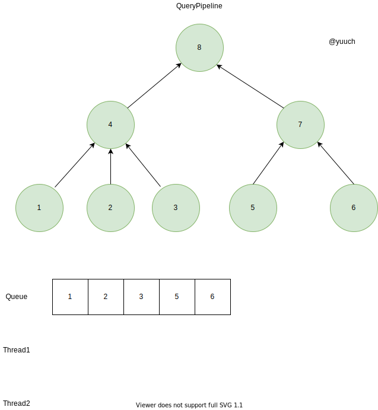
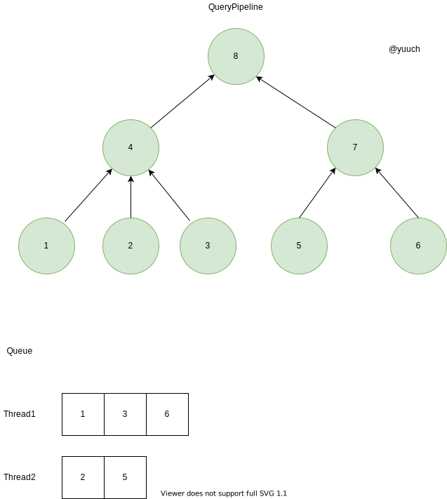
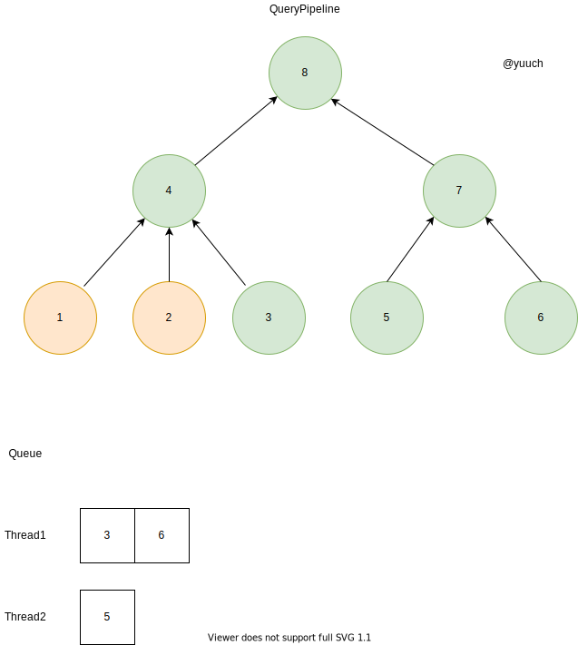
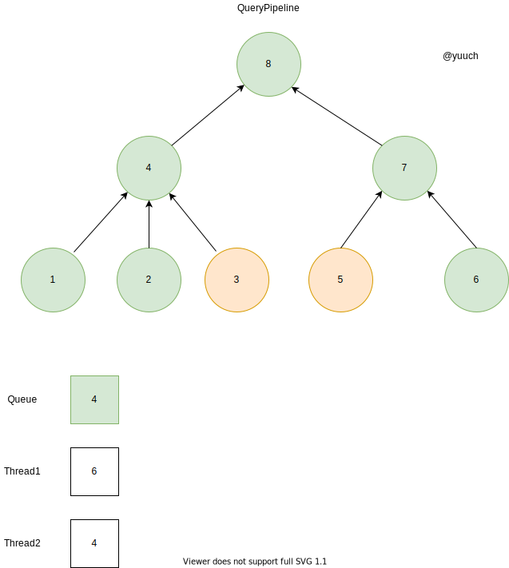
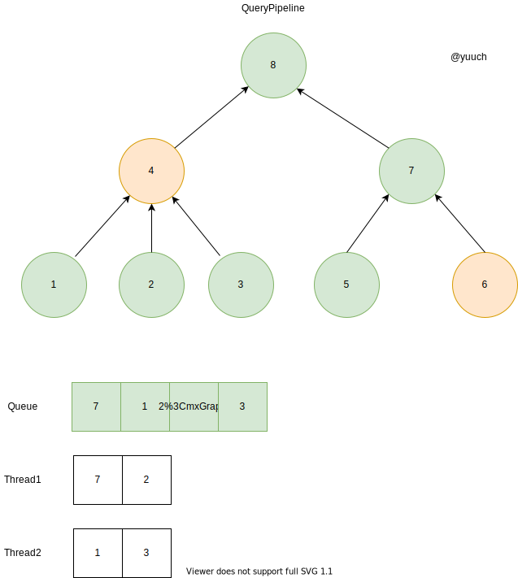
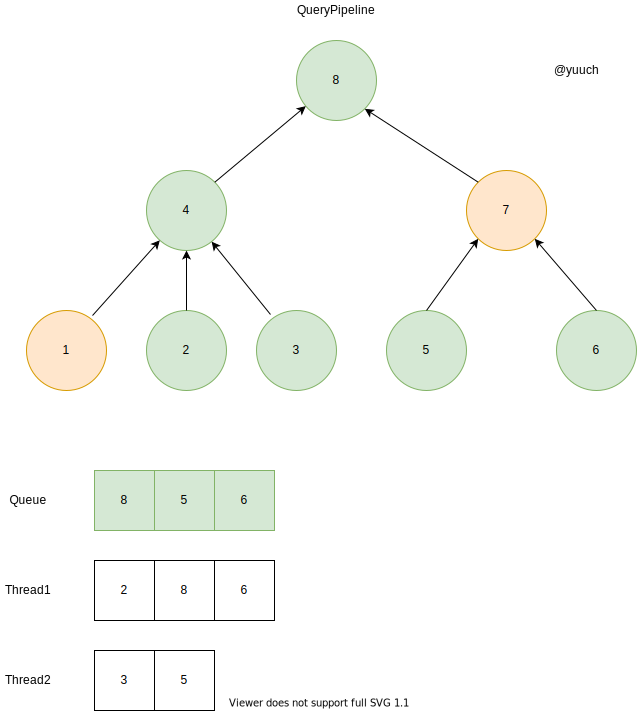
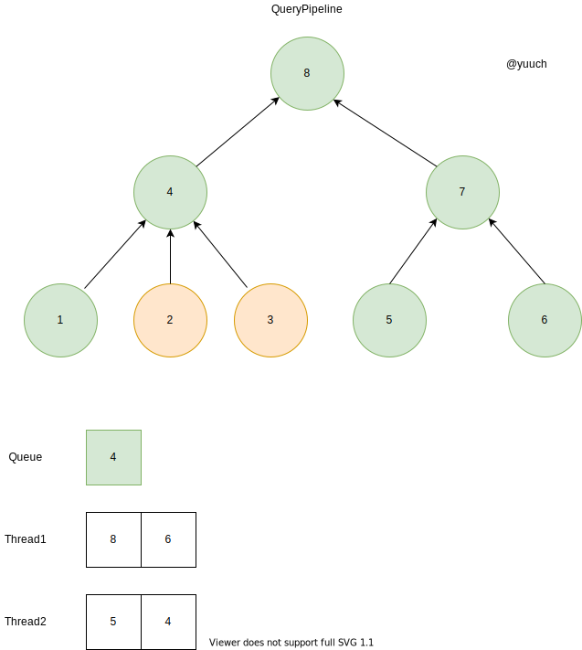
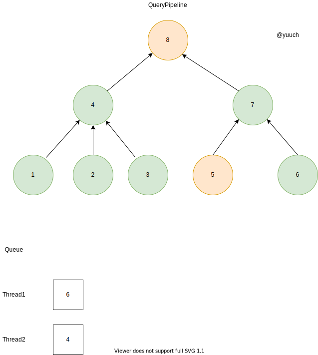

# QueryPipeline execute

上一节说到我们生成了一个Pipeline，那么Pipeline又是如何执行的呢？

这一节主要讲的就是pipeline的执行过程。


```cpp
    auto executor = state.io.pipeline.execute();
    executor->execute(state.io.pipeline.getNumThreads());
```


pipeline 会通过调用executor来生成 executor， executor执行execute，并指定执行的线程数。

## Executor构造

Executor的全名叫PipelineExecutor！
构造的函数大致如下，主要是构造出了一个ExecutingGraph,这是一个以processor为node，processor之间的连接为边的有向无环图。
```cpp
PipelineExecutor::PipelineExecutor(Processors & processors_, QueryStatus * elem)
{
        ///...
        graph = std::make_unique<ExecutingGraph>(processors);
        ///...
}
```

这里虽然说是把processor传进来构建成一个图，但其实node之间的连接，我们早就在生成pipeline的时候就把processor的port连接在一起了。
所以构造出来的图，与上一章节，提到的一致:



图中的箭头方向是数据流Stream 的方向


## Execute



有了这么一个有向图之后，我们该怎么执行呢？有向图是不是可以很快联想到拓扑排序呢？
没错。就是这样，先从叶子节点开始，
逐步流向根节点，最后的根结点就是我们要得到的结果。
执行的时候，会检查每个processor的状态，
只有在它的前后都是处于良好的状态的时候，我们才会把它置于Ready状态，
才会执行这个processor上的任务，
不断重复，知道所有的结点都finish。

假设我们有2个线程并行执行，首先我们会把所有的叶子节点存入一个Queue


把从上一步的Queue里的东西，平均的分到两个线程的队列里。


每个线程从各自的队列头里取出一个task执行。执行完之后会再做一次pull/push。这里的1，2task由于是叶子节点只能push。


上一步之行完之后，我们继续从线程的队列里取出task执行。当3结束之后，push了之后，发现4 ready了，于是就把它加入公共的queue，再把它分配到某个线程中去。



6结束之后，push之后发现7ready了， 于是把7放入queue；
4结束之后会做pull且push的操作，但是8只收到了4的数据，所以它还没有ready，
但是1，2，3就立马ready于是进入了queue
再分配到各个线程中去。


7结束之后，push，8就ready进入队列；
1结束之后，push，4未ready


2，3结束之后，push， 4 ready；


终于轮到8了;8执行结束就把数据吐了给了输出。


大概这样子，就给出了一个完整的PipelineExecutor执行的过程。我们可以看到我们的CPU一直都是很忙，没有因为数据未ready而在等待状态。
每次每个线程会与一个Processor绑定在一起执行，执行结束之后，会继续搜索处于Ready状态的Processor，大大的提高了CPU的利用率。

